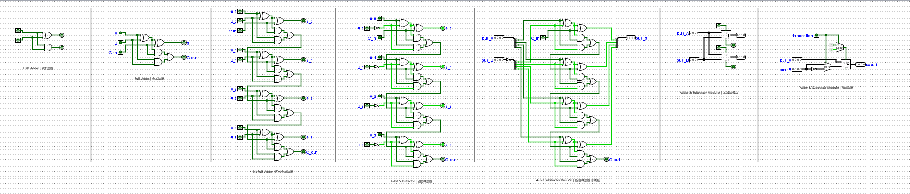

# How To Design A CPU | 如何设计一个 CPU

## 2. 数据表达

[知乎文章](https://zhuanlan.zhihu.com/p/242728867)

## 2. 二进制逻辑

[知乎文章](https://zhuanlan.zhihu.com/p/260080919)

## 3. 加法器 x 减法器

[知乎文章](https://zhuanlan.zhihu.com/p/260768538)

[Logisim 文件](https://raw.githubusercontent.com/T-K-233/How-To-Design-A-CPU-Logisim-Files/main/How_To_Design_A_CPU_3.circ)

